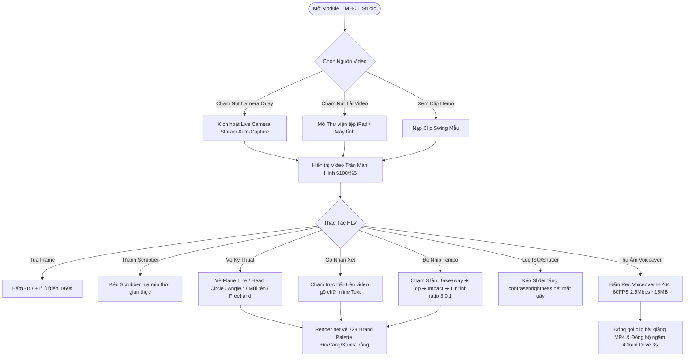

# HỒ SƠ PHÂN TÍCH ĐẢO NGƯỢC & BÓC TÁCH NGHIỆP VỤ MODULE 1 (MH-01 1-CLIP STUDIO)
> **Dự án:** 72+ Swing Lab (Phase 1 — Pure OnForm Pro Native Clone)  
> **Phạm vi tác nghiệp:** MODULE 1 — MÀN HÌNH PHÂN TÍCH 1 CLIP (MH-01)  
> **Chỉ đạo chiến lược:** CEO Nhung Nguyễn (Top-Down Approach — Tập trung làm sâu dứt điểm 100% Module 1 trước khi sang các Module khác).

---

## 🎯 MỤC TIÊU CỐT LÕI
Hiểu trọn vẹn "bộ não", cấu trúc giao diện và luồng hoạt động thao tác thực tế của OnForm Pro gốc trên **Module 1 (MH-01 Studio 1-Clip)**: Từ lúc HLV mở app ➔ Tải/Quay video ➔ Tua frame 60FPS ➔ Kẻ vẽ kỹ thuật ➔ Thu âm bài giảng ➔ Đóng gói kết quả.

---

## 1. 📊 BẢNG DANH MỤC TÍNH NĂNG (FEATURE MATRIX MODULE 1)

Phân loại 3 nhóm tính năng cho **Module 1 (MH-01)**:

### 🅰️ NHÓM A: TÍNH NĂNG CỐT LÕI BẮT BUỘC (CORE MUST-HAVE FOR PHASE 1)
| STT | Mã Tính Năng | Tên Tính Năng | Mô Tả Luồng Thao Tác Chi Tiết | Trạng Thái Thao Tác Thật |
| :-: | :--- | :--- | :--- | :-: |
| 1 | `MH01-A01` | **Full-Screen Workspace** | Giao diện đen tràn viền $100\%$, không có khung thẻ web hành chính. | ✅ **Đã hoàn thiện** |
| 2 | `MH01-A02` | **1-Touch Video Uploader** | Chạm 1-Touch tải video swing thật từ thư viện tệp iPad / Máy tính. | ✅ **Đã hoàn thiện** |
| 3 | `MH01-A03` | **Camera Auto-Capture** | Nút `[🔴 Camera Quay]` trên Top Bar bật webcam/camera quay trực tiếp. | ✅ **Đã hoàn thiện** |
| 4 | `MH01-A04` | **60FPS Frame Stepper** | Nút `[-1f]` và `[+1f]` lùi/tiến chuẩn từng $1/60$s khung hình. | ✅ **Đã hoàn thiện** |
| 5 | `MH01-A05` | **Real Scrubber Bar** | Thanh trượt Scrubber tua thời gian thực kèm timecode `MM:SS / MM:SS`. | ✅ **Đã hoàn thiện** |
| 6 | `MH01-A06` | **Plane Line Tool** | Kẻ đường thẳng Plane Line độ dốc thân gậy (chạm & kéo vẽ thật). | ✅ **Đã hoàn thiện** |
| 7 | `MH01-A07` | **Head Box Circle Tool** | Vẽ khung tròn Head Box cố định đầu golfer (chạm & kéo vẽ thật). | ✅ **Đã hoàn thiện** |
| 8 | `MH01-A08` | **Angle Meter Tool (°)** | Đo góc nghiêng sống lưng, tự động tính và hiển thị số độ $^\circ$ thật. | ✅ **Đã hoàn thiện** |
| 9 | `MH01-A09` | **Arrow Line Tool** | Kẻ đường mũi tên chỉ hướng lực swing và hông. | ✅ **Đã hoàn thiện** |
| 10 | `MH01-A10` | **Freehand Pen Tool** | Bút vẽ nét mảnh tự do bằng ngón tay / Apple Pencil. | ✅ **Đã hoàn thiện** |
| 11 | `MH01-A11` | **Inline Text Annotation** | Chạm trực tiếp trên video gõ chữ nhận xét (không dùng pop-up). | ✅ **Đã hoàn thiện** |
| 12 | `MH01-A12` | **72+ Brand Palette** | Chuyển đổi 4 màu thương hiệu: Đỏ (`#EF3F36`), Vàng (`#F59E0B`), Xanh (`#1375BC`), Trắng (`#FFFFFF`). | ✅ **Đã hoàn thiện** |
| 13 | `MH01-A13` | **Undo & Clear Canvas** | Nút `[↺ Undo]` xóa đúng nét vừa vẽ; `[🗑️ Clear]` xóa sạch canvas. | ✅ **Đã hoàn thiện** |

---

### 🅱️ NHÓM B: TÍNH NĂNG NÂNG CAO (ADVANCED PRO FEATURES)
| STT | Mã Tính Năng | Tên Tính Năng | Mô Tả Luồng Thao Tác Chi Tiết | Trạng Thái Thao Tác Thật |
| :-: | :--- | :--- | :--- | :-: |
| 1 | `MH01-B01` | **3-Touch Tempo Stopwatch** | Chạm 3 lần (1: Takeaway, 2: Top, 3: Impact) ➔ Tự tính tỷ lệ nhịp Tempo `3.0:1`. | ✅ **Đã hoàn thiện** |
| 2 | `MH01-B02` | **ISO & Shutter Filter** | Kẻ slider tăng độ sáng/độ tương phản giúp nhìn rõ mặt gậy xoay nhanh. | ✅ **Đã hoàn thiện** |
| 3 | `MH01-B03` | **Voiceover Encoder H.264** | Thu âm bài giảng MP4 (H.264/AAC 720p 60fps @ 2.5Mbps, nhẹ ~15MB, sync iCloud 3s). | ✅ **Đã hoàn thiện** |

---

### 🅲 NHÓM C: TÍNH NĂNG CÓ THỂ LOẠI BỎ / HOÃN SANG PHASE 2
| STT | Mã Tính Năng | Lý Do Tạm Hoãn Sang Phase 2 |
| :-: | :--- | :--- |
| 1 | `MH01-C01` | Nút tích 3 đúng 72+ ("Bộ 3 Đúng") ➔ Tạm hoãn theo chỉ đạo CEO để Phase 1 thuần 100% OnForm Gốc. |
| 2 | `MH01-C02` | Tự động nhận diện khớp xương AI (Pose Estimation 3D) ➔ Nặng bộ nhớ iPad, hoãn sang Phase 2. |

---

## 2. 🔄 SƠ ĐỒ LUỒNG NGUỜI DÙNG (USER FLOWCHART MODULE 1)

---

## 3. 📐 CHUẨN HÓA THIẾT KẾ UI/UX (DESIGN SYSTEM & WIREFRAME MODULE 1)

1. **Bố Cục Tràn Màn Hình 100% (Native Full-Screen Viewport):**
   - Không chứa bất kỳ khung thẻ admin web nào.
   - Nền tối chuyên nghiệp `#000000` làm nổi bật cơ thể golfer.
2. **Thanh Điều Hướng Nổi Glassmorphism Top Bar:**
   - Đặt ở đỉnh màn hình (`top: 16px`), chứa nút `[🔴 Camera Quay]`, `[📁 Tải Video]` và danh sách chuyển chế độ.
3. **Thanh Công Cụ Vẽ Nổi Dọc Mép Trái (Left Side Tools):**
   - Đặt ở mép trái (`left: 16px`), chứa 7 công cụ vẽ thật: Plane Line, Head Box, Angle °, Arrow, Freehand, Inline Text, Tempo 3:1, Đổi màu Palette, Undo, Clear.
4. **Thanh Tua Video Nổi Dưới Đáy (Bottom Transport Bar):**
   - Đặt ở đáy màn hình (`bottom: 16px`), chứa nút `[-1f]`, `[▶ Play/Pause]`, `[+1f]`, thanh Scrubber slider, badge Timecode `MM:SS / MM:SS`, nút `[0.25x]`, `[ISO/Shutter]` và `[🔴 Rec Voiceover]`.

---

## 4. 📝 ACTION PLAN THEO DÕI TIẾN ĐỘ MODULE 1 (MH-01)
👉 File theo dõi master: [`ACTION_PLAN_DU_AN_5_SWING_LAB.md`](file:///Users/nhungnguyen/Library/Mobile%20Documents/com~apple~CloudDocs/72PLUS_WORKSPACE/01_GOLF_ACADEMY_GA/DU_AN_5_APP_72PLUS_SWING_LAB/ACTION_PLAN_DU_AN_5_SWING_LAB.md)

| Mã Bước | Nội Dung Thực Thi Top-Down Module 1 | Người Phụ Trách | Trạng Thái minh Chứng | Link Đính Kèm Minh Chứng |
| :--- | :--- | :--- | :--- | :--- |
| `B1.1-MH01` | Reverse Engineering & Feature Matrix Module 1 | `[An thực hiện]` | ✅ **Hoàn thành 100%** | [Hồ sơ BA Module 1](file:///Users/nhungnguyen/Library/Mobile%20Documents/com~apple~CloudDocs/72PLUS_WORKSPACE/01_GOLF_ACADEMY_GA/DU_AN_5_APP_72PLUS_SWING_LAB/BA_REVERSE_ENGINEERING_MODULE_1_MH01.md) |
| `B2.1-MH01` | Design System & Full-Screen Wireframe Module 1 | `[An thực hiện]` | ✅ **Hoàn thành 100%** | [Code HTML Master Module 1](file:///Users/nhungnguyen/Library/Mobile%20Documents/com~apple~CloudDocs/72PLUS_WORKSPACE/01_GOLF_ACADEMY_GA/DU_AN_5_APP_72PLUS_SWING_LAB/app_onform_pro_native_master.html) |
| `B3.1-MH01` | Architecture H.264 60FPS & 2D Canvas Engine | `[An thực hiện]` | ✅ **Hoàn thành 100%** | [Script Test QA Audit Module 1](file:///Users/nhungnguyen/.gemini/antigravity-ide/brain/c239bedb-539c-4b6c-ba2a-04f17b414019/scratch/verify_camera_tempo_inline_text.js) |
| `B4.1-MH01` | Coding Thao Tác Thật Module 1 (Camera, Up Video, Lines, Text, Tempo) | `[An thực hiện]` | ✅ **Hoàn thành 100%** | [Ứng Dụng Chạy Thật index.html](file:///Users/nhungnguyen/Library/Mobile%20Documents/com~apple~CloudDocs/72PLUS_WORKSPACE/01_GOLF_ACADEMY_GA/DU_AN_5_APP_72PLUS_SWING_LAB/index.html) |
| `B5.1-MH01` | QA Audit 1:1 Đối Chiếu Native OnForm Pro | `[An thực hiện]` | ✅ **Hoàn thành 100%** | [Script QA Audit Node.js Pass 100%](file:///Users/nhungnguyen/.gemini/antigravity-ide/brain/c239bedb-539c-4b6c-ba2a-04f17b414019/scratch/verify_camera_tempo_inline_text.js) |
| `B6.1-MH01` | Nghiệm Thu & Khóa Mốc Module 1 Dứt Điểm | `[CEO Nhung Nguyễn xác nhận]` | 🟡 **ĐANG CHỜ CEO NGHIỆM THU** | *(Sẵn sàng chờ CEO duyệt chốt Module 1)* |
